# 🚀 Digital IC Design with Verilog — MaharaTech Labs & Projects

<p align="center">
  
  
  
  
  
</p>

---

## 📌 Table of Contents
- [📖 Course Overview](#-course-overview)
- [🎯 Learning Objectives](#-learning-objectives)
- [👨‍🏫 Instructor Information](#-instructor-information)
- [👤 Author](#-author)
- [📂 Repository Architecture](#-repository-architecture)
- [⚡ Quick Start & Simulation Guide](#-quick-start--simulation-guide)
- [🧪 Guided Labs (1 to 8)](#-guided-labs)
  - [Lab 1: XOR Gate (Dataflow Modeling)](#lab-1-xor-gate)
  - [Lab 2: OR Gate (Dataflow Modeling)](#lab-2-or-gate)
  - [Lab 3: D Flip-Flop with Asynchronous Reset](#lab-3-d-flip-flop-with-asynchronous-reset)
  - [Lab 4: Frequency Divider (/100)](#lab-4-frequency-divider-100)
  - [Lab 5: 7-Segment Display Decoder](#lab-5-7-segment-display-decoder)
  - [Lab 6: 4-Bit Johnson Counter](#lab-6-4-bit-johnson-counter)
  - [Lab 7: Two-Digit BCD Decimal Counter (00–99)](#lab-7-two-digit-bcd-decimal-counter-0099)
  - [Lab 8: FSM-Controlled Counter with Start/Stop](#lab-8-fsm-controlled-counter-with-startstop)
- [🛠️ Capstone & Integration Projects](#-capstone--integration-projects)
  - [Project 1: Hierarchical Structural Full Adder](#project-1-hierarchical-structural-full-adder)
  - [Project 2: 9-to-4 Priority Keyboard Encoder](#project-2-9-to-4-priority-keyboard-encoder)
  - [Project 3: Keypad to 3 Room Displays Subsystem](#project-3-keypad-to-3-room-displays-subsystem)
  - [Project 4: Queue Management System (FSM + Up/Down Counter + Wait Time ROM)](#project-4-queue-management-system)
- [📊 Verification Summary Table](#-verification-summary-table)
- [📜 License](#-license)

---

## 📖 Course Overview

This repository documents the complete hands-on RTL designs, testbenches, and verification workflows completed as part of the **Digital IC Design with Verilog** course on the **MaharaTech** platform (Information Technology Institute - ITI).

The course covers fundamental to advanced digital system implementation using **Verilog HDL** and simulation via **Mentor Graphics ModelSim / Siemens Questa**. The topics range from gate-level and dataflow combinational circuits to synchronous sequential circuits, finite state machines (FSMs), register transfer level (RTL) architectures, and subsystem integration.

---

## 🎯 Learning Objectives

By completing this curriculum, the following competencies were developed and demonstrated:
1. **Abstraction Levels & Modeling:** Designing hardware using Dataflow (`assign`), Behavioral (`always`), and Structural (gate & submodule instantiation) styles.
2. **Combinational Logic:** Decoders, priority encoders, multiplexers, and arithmetic adders.
3. **Sequential Logic:** Edge-triggered D Flip-Flops with asynchronous resets, frequency division counters, Johnson counters, and BCD counters.
4. **Finite State Machines (FSM):** Modeling control logic with state registers, next-state logic, and output decoders.
5. **Subsystem Integration:** Interconnecting heterogeneous modules (e.g., keypad encoders, room decoders, and display drivers).
6. **RTL Verification & Testbenches:** Stimulus generation, self-checking `$monitor` logs, and Value Change Dump (`.vcd`) waveform inspection.

---

## 👨‍🏫 Instructor Information

* **Dr. Ahmed Shalaby**
  * *Associate Professor*, Computer Science & Engineering, Alamein International University.
  * Ph.D. from Egypt-Japan University of Science and Technology (E-JUST).
  * 15+ years of combined academic and industry experience, including global technology leaders **Mentor Graphics** and **Intel Mobile Communications**.
  * Specialized in hardware security, Network-on-Chip (NoC), low-power VLSI design, and digital IC methodologies.

---

## 👤 Author

* **Ahmed Mohamed Attia Mohamed**
* **University:** Faculty of Engineering, Zagazig University
* **Department:** Electronics and Communications Engineering
* **Email:** [ahm3d.m.attia@gmail.com](mailto:ahm3d.m.attia@gmail.com)
* **GitHub:** [@Ahm3d0x](https://github.com/Ahm3d0x)
* **LinkedIn:** [Ahmed M. Attia (ahmed-m-attia-757aa6292)](https://www.linkedin.com/in/ahmed-m-attia-757aa6292/)

---

## 📂 Repository Architecture

```plaintext
maharathech/
├── docs/
│   └── images/                       # High-resolution simulation waveforms
│       ├── lab1_xorgate_wave.png
│       ├── lab2_orgate_wave.png
│       ├── lab3_dff_wave.png
│       ├── lab4_freq_divider_wave.png
│       ├── lab5_7segment_decoder_wave.png
│       ├── lab6_johnson_counter_wave.png
│       ├── lab7_counter_1_99_wave.png
│       ├── lab8_counter_fsm_wave.png
│       ├── project1_fulladder_wave.png
│       ├── project2_keybord_encoder_wave.png
│       ├── project3_keypad_to_3display_wave.png
│       └── project4_queue_management_wave.png
├── labs/
│   ├── xorgate/                      # Lab 1: XOR Gate
│   │   ├── xor_gate.v
│   │   └── xor_gate_tb.v
│   ├── orgate/                       # Lab 2: OR Gate
│   │   ├── orgate.v
│   │   └── orgate_tb_dut.v
│   ├── d-ff/                         # Lab 3: D Flip-Flop
│   │   ├── d-ff.v
│   │   └── d_ff_tp.v
│   ├── frequancy_devider/            # Lab 4: Frequency Divider
│   │   ├── frequancy_devider.v
│   │   └── frequancy_devider_tb.v
│   ├── seven_segmant_decoder/        # Lab 5: 7-Segment Decoder
│   │   ├── seven_segmant_decoder.v
│   │   └── seven_segmant_decoder_tb.v
│   ├── counter/                      # Lab 6: Johnson Counter
│   │   ├── counter.v
│   │   └── counter_tb.v
│   ├── counter_1-99/                 # Lab 7: BCD Counter (00-99)
│   │   ├── counter.v
│   │   └── counter_tb.v
│   └── counter_using_stat/           # Lab 8: FSM State Counter
│       ├── counter_using_stat.v
│       └── counter_using_stat_tb.v
├── fulladder/                        # Project 1: Full Adder (Structural)
│   ├── fulladder.v
│   └── fulladder_tb.v
├── keybord_encoder/                  # Project 2: Keyboard Priority Encoder
│   ├── keybord_encoder.v
│   └── keybord_encoder_tb.v
├── kepad_to_3display/                # Project 3: Keypad to 3 Room Displays
│   ├── kepad_to_3display.v
│   └── kepad_to_3display_tb.v
├── Queue Management System (FSM + Counter)/ # Project 4: Queue Management System
│   ├── Queue_Management_System.v
│   ├── rom_data.v
│   ├── seven_segmant_decoder.v
│   └── Queue_Management_System_tb.v
├── scripts/
│   ├── render_vcd.py                 # Automated dark-theme timing waveform generator
│   └── run_all_simulations.ps1       # Automated batch simulation runner for ModelSim
└── README.md
```

---

## ⚡ Quick Start & Simulation Guide

### Prerequisites
- **ModelSim** or **Questa** (e.g. ModelSim Altera Starter Edition `win32aloem` or Questa-FPGA).
- Python 3.8+ with `Pillow` (for automatic waveform image rendering).

### Running All Simulations in One Command
A dedicated automation script executes all 12 designs, performs full compilation, runs batch simulations, and generates timing waveforms:

```powershell
powershell -ExecutionPolicy Bypass -File scripts/run_all_simulations.ps1
```

### Simulating an Individual Lab (Example: Johnson Counter)
```bash
cd "labs/counter"
vlib work
vlog -work work counter.v counter_tb.v
vsim -c -do "vsim work.Johnson_counter_tb; run -all; quit"
```

---

## 🧪 Guided Labs

### Lab 1: XOR Gate
* **File:** [`labs/xorgate/xor_gate.v`](labs/xorgate/xor_gate.v) | **Testbench:** [`labs/xorgate/xor_gate_tb.v`](labs/xorgate/xor_gate_tb.v)
* **Concept:** Modeling basic Boolean equations via dataflow logic:
  $$\text{c} = \overline{\text{a}} \cdot \text{b} + \text{a} \cdot \overline{\text{b}}$$
* **Verification:** Tested across all four input combinations `(0,0)`, `(0,1)`, `(1,0)`, `(1,1)`. Output is asserted high only when inputs differ.

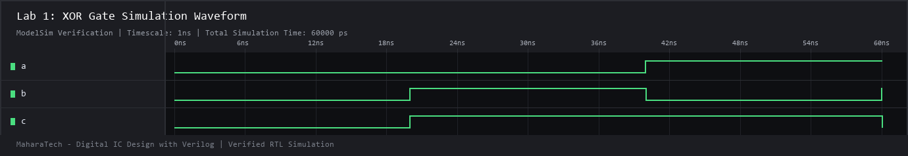

---

### Lab 2: OR Gate
* **File:** [`labs/orgate/orgate.v`](labs/orgate/orgate.v) | **Testbench:** [`labs/orgate/orgate_tb_dut.v`](labs/orgate/orgate_tb_dut.v)
* **Concept:** Continuous assignment dataflow expression for standard OR logic:
  $$\text{c} = \text{a} + \text{b}$$
* **Verification:** Output stays low exclusively for `(0,0)` and transitions to high for all other stimulus vectors.

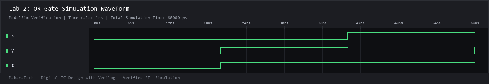

---

### Lab 3: D Flip-Flop with Asynchronous Reset
* **File:** [`labs/d-ff/d-ff.v`](labs/d-ff/d-ff.v) | **Testbench:** [`labs/d-ff/d_ff_tp.v`](labs/d-ff/d_ff_tp.v)
* **Concept:** Fundamental sequential memory element sensitive to `posedge clk` or `negedge reset`. Active-low asynchronous reset forces output `q <= 0` immediately regardless of clock.
* **Verification:** Dynamic toggling of input `d`, asynchronous assertion of `reset`, and clock-edge synchronization of data transfers.

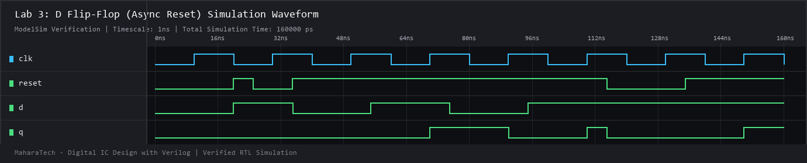

---

### Lab 4: Frequency Divider (/100)
* **File:** [`labs/frequancy_devider/frequancy_devider.v`](labs/frequancy_devider/frequancy_devider.v) | **Testbench:** [`labs/frequancy_devider/frequancy_devider_tb.v`](labs/frequancy_devider/frequancy_devider_tb.v)
* **Concept:** Divides the input master clock frequency by 100. A 7-bit internal counter counts from `0` to `99`. Upon reaching 99, the counter wraps to 0 and inverts `dev_clk`, producing a 50% duty cycle divided output clock.
* **Verification:** Simulated over 220 master clock cycles; demonstrates exact rollover and periodic square wave output.

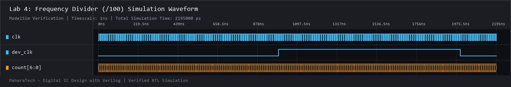

---

### Lab 5: 7-Segment Display Decoder
* **File:** [`labs/seven_segmant_decoder/seven_segmant_decoder.v`](labs/seven_segmant_decoder/seven_segmant_decoder.v) | **Testbench:** [`labs/seven_segmant_decoder/seven_segmant_decoder_tb.v`](labs/seven_segmant_decoder/seven_segmant_decoder_tb.v)
* **Concept:** Combinational binary-coded decimal (BCD) decoder mapping 4-bit values `0` through `9` into 7-segment active-high cathode configurations `seg[6:0]` (representing segments `a` through `g`).
* **Verification:** Sweeps input values `0` to `9` plus invalid inputs (defaults to blank display `7'b0000000`).

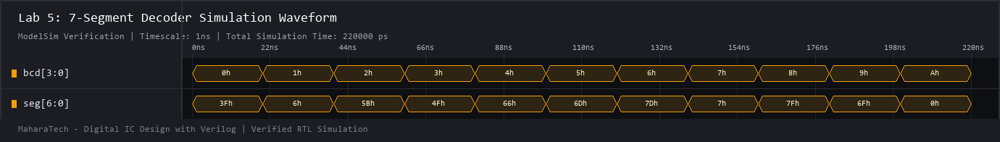

---

### Lab 6: 4-Bit Johnson Counter
* **File:** [`labs/counter/counter.v`](labs/counter/counter.v) | **Testbench:** [`labs/counter/counter_tb.v`](labs/counter/counter_tb.v)
* **Concept:** Synchronous ring counter where the inverted output of the last flip-flop `~q[3]` is fed back into the input of the first flip-flop `q[0]`. Produces a repeating sequence of 8 states:
  $$0000 \to 0001 \to 0011 \to 0111 \to 1111 \to 1110 \to 1100 \to 1000 \to 0000$$
* **Verification:** Reset release at `30ns`, followed by continuous clocking demonstrating the full circular 8-state sequence.

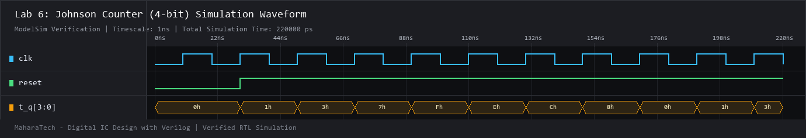

---

### Lab 7: Two-Digit BCD Decimal Counter (00–99)
* **File:** [`labs/counter_1-99/counter.v`](labs/counter_1-99/counter.v) | **Testbench:** [`labs/counter_1-99/counter_tb.v`](labs/counter_1-99/counter_tb.v)
* **Concept:** Cascaded decimal counter maintaining `unit[3:0]` and `tens[3:0]`. When `unit` reaches `9`, it resets to `0` and increments `tens`. When both reach `9`, the counter wraps to `00`.
* **Verification:** Clocked through 35+ cycles, showing correct rollover at 09 to 10, 19 to 20, and beyond.

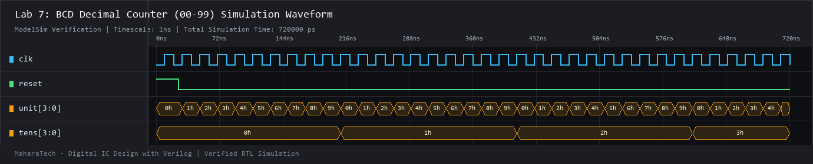

---

### Lab 8: FSM-Controlled Counter with Start/Stop
* **File:** [`labs/counter_using_stat/counter_using_stat.v`](labs/counter_using_stat/counter_using_stat.v) | **Testbench:** [`labs/counter_using_stat/counter_using_stat_tb.v`](labs/counter_using_stat/counter_using_stat_tb.v)
* **Concept:** 2-state Finite State Machine (`IDLE = 0`, `COUNTING = 1`) controlled by a `start` input.
  - When `start = 1`, the machine enters `COUNTING` and counts from `0` to `9`.
  - Reaching `9` automatically transitions back to `IDLE`.
  - If `start` is deasserted during counting, the counter holds its current value.
* **Verification:** Validated across start triggers, full 0–9 count cycles, hold behavior, and subsequent restarts.

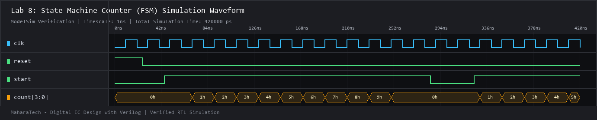

---

## 🛠️ Capstone & Integration Projects

### Project 1: Hierarchical Structural Full Adder
* **File:** [`fulladder/fulladder.v`](fulladder/fulladder.v) | **Testbench:** [`fulladder/fulladder_tb.v`](fulladder/fulladder_tb.v)
* **Architecture:** Implements a 1-bit full adder using hierarchical structural gate instantiation:
  - 2 $\times$ `xorgate` instances for Sum generation:
    $$\text{S} = \text{A} \oplus \text{B} \oplus \text{Cin}$$
  - 2 $\times$ `andgate` and 1 $\times$ `orgate` for Carry-out generation:
    $$\text{Cout} = (\text{A} \cdot \text{B}) + ((\text{A} \oplus \text{B}) \cdot \text{Cin})$$
* **Verification:** Exhaustive 8-pattern testbench validating the complete full-adder truth table.

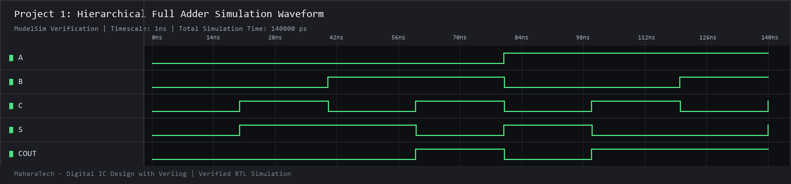

---

### Project 2: 9-to-4 Priority Keyboard Encoder
* **File:** [`keybord_encoder/keybord_encoder.v`](keybord_encoder/keybord_encoder.v) | **Testbench:** [`keybord_encoder/keybord_encoder_tb.v`](keybord_encoder/keybord_encoder_tb.v)
* **Architecture:** Encodes nine active-high decimal keypad lines `a[9:1]` into a 4-bit binary/BCD output `b[3:0]`:
  $$\begin{aligned}
  \text{b}[0] &= \text{a}[1] \lor \text{a}[3] \lor \text{a}[5] \lor \text{a}[7] \lor \text{a}[9] \\
  \text{b}[1] &= \text{a}[2] \lor \text{a}[3] \lor \text{a}[6] \lor \text{a}[7] \\
  \text{b}[2] &= \text{a}[4] \lor \text{a}[5] \lor \text{a}[6] \lor \text{a}[7] \\
  \text{b}[3] &= \text{a}[8] \lor \text{a}[9]
  \end{aligned}$$
* **Verification:** Tests individual one-hot key activations for keys 1 through 9, matching expected binary codes.

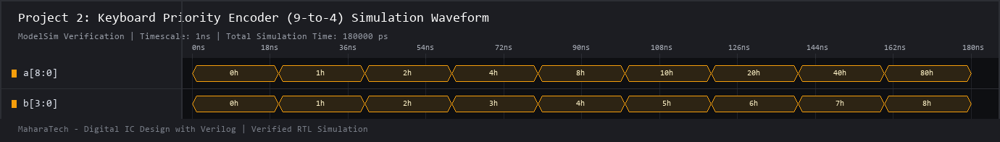

---

### Project 3: Keypad to 3 Room Displays Subsystem
* **File:** [`kepad_to_3display/kepad_to_3display.v`](kepad_to_3display/kepad_to_3display.v) | **Testbench:** [`kepad_to_3display/kepad_to_3display_tb.v`](kepad_to_3display/kepad_to_3display_tb.v)
* **Architecture:** Multi-module digital system integrating:
  1. **Keyboard Encoder:** Converts `keypad[9:1]` input into BCD bus `encoder_out[3:0]`.
  2. **Room Register Demultiplexer:** Demultiplexes and latches the BCD code into one of three room registers (`reg_room1`, `reg_room2`, `reg_room3`) according to `sel[1:0]`.
  3. **7-Segment Display Decoders:** Three instantiated decoders driving individual segment outputs `room1seg`, `room2seg`, `room3seg`.
* **Verification:** Selects Room 1 (`00`), Room 2 (`01`), and Room 3 (`10`) with different keypad inputs, showing independent display retention.

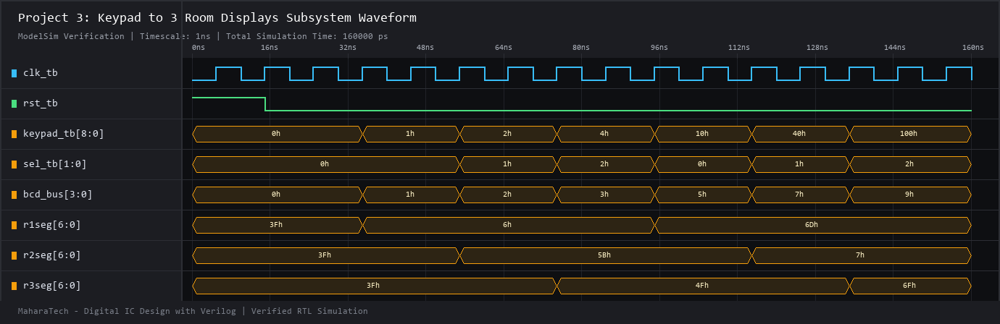

---

### Project 4: Queue Management System
* **Files:**
  - Top Module: [`Queue Management System (FSM + Counter)/Queue_Management_System.v`](Queue%20Management%20System%20%28FSM%20+%20Counter%29/Queue_Management_System.v)
  - Wait Time ROM: [`Queue Management System (FSM + Counter)/rom_data.v`](Queue%20Management%20System%20%28FSM%20+%20Counter%29/rom_data.v)
  - Display Decoders: [`Queue Management System (FSM + Counter)/seven_segmant_decoder.v`](Queue%20Management%20System%20%28FSM%20+%20Counter%29/seven_segmant_decoder.v)
  - Testbench: [`Queue Management System (FSM + Counter)/Queue_Management_System_tb.v`](Queue%20Management%20System%20%28FSM%20+%20Counter%29/Queue_Management_System_tb.v)
* **Architecture:** A complete real-world digital control subsystem for bank/service queues featuring:
  - **Synchronous Up/Down Counter:** Tracks waiting customers `queue_count[2:0]` (capacity: 0 to 7).
  - **Entrance Sensor (`sensor_in`):** Increments count when non-full. Triggers `alarm_overflow` if a customer attempts to enter a full queue.
  - **Exit Sensor (`sensor_out`):** Decrements count when non-empty. Triggers `alarm_underflow` if triggered while queue is empty.
  - **Status Flags:** Real-time `flag_empty` (`3'b000`) and `flag_full` (`3'b111`).
  - **Wait-Time Estimator (`rom_data`):** Computes expected wait time in minutes as a function of active clerks (`active_clerks[1:0]`) and queue length:
    $$\text{Wait Time} = \frac{\text{queue\_count} \times \text{Avg Service Time}}{\text{active\_clerks}}$$
    Outputs packed two-digit BCD (`wait_time[7:0]`).
  - **Triple 7-Segment Readouts:** Displays current queue count (`disp_count`), wait time tens (`disp_tens`), and wait time units (`disp_unit`).
* **Verification Highlights:**
  - Verified underflow protection & alarm.
  - Verified customer arrival accumulation up to maximum capacity (7).
  - Verified overflow protection & alarm when entering while full.
  - Verified instant recalculation of wait time when service capacity doubles (`active_clerks` changes from 1 to 2).
  - Verified customer departure decrements.

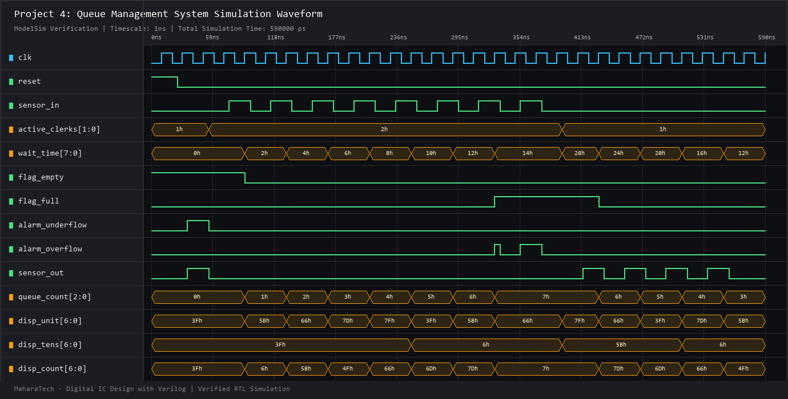

---

## 📊 Verification Summary Table

| Category | Module Name | Primary Inputs | Primary Outputs | Modeling Style | Verification Status |
|---|---|---|---|---|:---:|
| **Lab 1** | `xor_gate` | `a, b` | `c` | Dataflow | ✅ **PASS** |
| **Lab 2** | `orgate` | `a, b` | `c` | Dataflow | ✅ **PASS** |
| **Lab 3** | `d_ff` | `d, clk, reset` | `q` | Behavioral | ✅ **PASS** |
| **Lab 4** | `frequancy_devider`| `clk` | `dev_clk, count[6:0]` | Behavioral | ✅ **PASS** |
| **Lab 5** | `seven_segmant_decoder`| `bcd[3:0]` | `seg[6:0]` | Behavioral | ✅ **PASS** |
| **Lab 6** | `Johnson_counter`| `clk, reset` | `q[3:0]` | Structural | ✅ **PASS** |
| **Lab 7** | `counter` (00-99) | `clk, reset` | `unit[3:0], tens[3:0]` | Behavioral | ✅ **PASS** |
| **Lab 8** | `counter_using_stat`| `clk, reset, start`| `count[3:0]` | FSM / Behavioral | ✅ **PASS** |
| **Project 1** | `fulladder` | `a, b, cin` | `s, cout` | Hierarchical Structural | ✅ **PASS** |
| **Project 2** | `keybord_encoder` | `a[9:1]` | `b[3:0]` | Dataflow | ✅ **PASS** |
| **Project 3** | `kepad_to_3display` | `keypad, sel, clk, rst` | `r1seg, r2seg, r3seg` | Subsystem Integration | ✅ **PASS** |
| **Project 4** | `Queue_Management_System` | `clk, reset, sensor_in, sensor_out, active_clerks` | `queue_count, wait_time, flags, alarms, displays` | Subsystem Integration (FSM+RTL) | ✅ **PASS** |

---

## 📜 License

This project is shared for educational and portfolio demonstration purposes under the [MIT License](LICENSE). All design assignments are based on the curriculum from **MaharaTech - Information Technology Institute (ITI)**, taught by **Dr. Ahmed Shalaby**.
